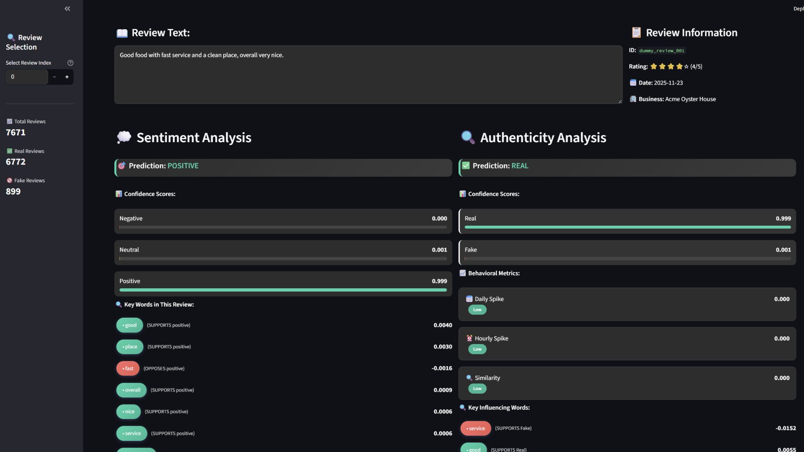

# User-Centered XAI for Fake Review Detection and Sentiment Analysis


## Summary
This project applies Explainable AI (XAI) techniques to detect fake reviews and analyze sentiment using the Yelp Open Dataset. Traditional machine learning models are combined with LIME and SHAP explainability methods, then packaged into an interactive Streamlit dashboard so that non-technical users can understand why a review is flagged as fake or genuine.

## Problem
1. **Fake Review Detection:** Online platforms are increasingly affected by fake reviews that mislead consumers, requiring a reliable model to distinguish fake from genuine reviews using both text and behavioral signals.
2. **Black-Box Model Interpretability:** High-performing ML models (XGBoost, SVM, Random Forest, CatBoost, LightGBM) are often difficult for non-technical stakeholders to interpret, creating a need for a user-centered explanation layer.
3. **Bridging Technical and Non-Technical Users:** Needed a way to present complex model outputs (SHAP/LIME) in a simplified, accessible format for end users without a data science background.

## Methodology
1. **Data Pre-Processing:** Cleaned and prepared raw Yelp review data for modeling (`1. Pre-Processing/Pre_processing.ipynb`).
2. **Labeling:** Labeled reviews as fake/genuine and validated label quality (`2. Labeling/Labeling.ipynb`, `Check_label.ipynb`).
3. **Feature Engineering & Modeling:**
   - Text features: TF-IDF with Sublinear TF and N-gram representation
   - Behavioral features: daily spike, hourly spike, and similarity score
   - Trained and compared five models: XGBoost, SVM, Random Forest, CatBoost, and LightGBM for both fake review detection and sentiment analysis (`3. Modeling/`)
4. **Dataset Merging:** Merged processed data with original review text for downstream analysis (`4. Merge dataset for getting text/Merge.ipynb`).
5. **Explainability (XAI):**
   - **SHAP (Global):** Identified overall feature importance across the dataset, with behavioral features (spike scores, similarity) emerging as top indicators.
   - **LIME (Local):** Highlighted influential words and behaviors for individual review predictions, simplified for dashboard use.
6. **Dashboard Development:** Built an interactive Streamlit dashboard so users can browse reviews, view predictions, and read simplified explanations (`5. Dashboard/dashboard_review_analysis.py`).

## Skills
1. **Python:** Data preprocessing, feature engineering, modeling pipeline
2. **Machine Learning:** XGBoost, SVM, Random Forest, CatBoost, LightGBM
3. **NLP:** TF-IDF, Sublinear TF, N-gram text representation
4. **Explainable AI (XAI):** LIME (local interpretation), SHAP (global interpretation)
5. **Dashboard Development:** Streamlit, user-centered UI/UX for non-technical audiences

## Results
1. **Best Performing Model:** XGBoost achieved the best results for both fake review detection and sentiment analysis tasks among the five models tested.
2. **Key Predictive Signals:** SHAP analysis revealed that behavioral features (spike scores and similarity score) were among the strongest indicators of fake reviews, beyond text-based features alone.
3. **Improved Interpretability:** Combining LIME's local explanations with SHAP's global view allowed the dashboard to present both "why this specific review is fake" and "what generally drives fake review predictions," making the system usable by non-technical stakeholders.

## Next Steps
1. **Public Dataset Compliance:** Continue using dummy examples and derived features in the public dashboard to comply with Yelp Open Dataset terms of service, while exploring anonymized real-data demos for research purposes.
2. **Model Deployment:** Package trained models for lightweight deployment (e.g., model compression) since current `.pkl` files exceed GitHub's storage limits.
3. **Expanded Evaluation:** Test the pipeline on additional review platforms beyond Yelp to assess generalizability of the behavioral + text feature approach.

---

## 📁 Repository Structure
> Note: The `.pkl` model files are not included in this repository because their size exceeds GitHub's storage limitations.

```
📦 root/
│
├── 1. Pre-Processing/
│ └── Pre_processing.ipynb
│
├── 2. Labeling/
│ ├── Check_label.ipynb
│ └── Labeling.ipynb
│
├── 3. Modeling/
│ ├── Finalization_data.ipynb
│ ├── SublinearTF_FakeReal_.ipynb (SVM, RF, CatBoost, LightGBM, XGBoost)
│ └── SublinearTF_Sentiment_.ipynb (SVM, RF, CatBoost, LightGBM, XGBoost)
│
├── 4. Merge dataset for getting text/
│ └── Merge.ipynb
│
└── 5. Dashboard/
  ├── check.ipynb
  └── dashboard_review_analysis.py
```

## 🖥️ Running the Streamlit Dashboard
```bash
cd "5. Dashboard"
streamlit run dashboard_review_analysis.py
```

## ⚠️ Dataset Usage Disclaimer
This project uses the **Yelp Open Dataset** under its official Terms of Service. To comply with restrictions:
- Raw Yelp JSON files are not included
- Dashboard uses **dummy examples**
- Processed datasets contain **derived features only**

## 📚 Citation
If you use this repository for research:

Kelvin Jonathan Yusach, William, Henry Lucky, Rilo Chandra Pradana, Noviyanti Tri Maretta Sagala.
*User-Centered Interpretation Dashboard for Explainable AI in Fake Review Detection and Sentiment Analysis*, 2025.

## 👤 Authors
- Kelvin Jonathan Yusach — Conceptualization, Methodology, Software
- William — Conceptualization, Methodology, Software
- Henry Lucky — Supervision
- Rilo Chandra Pradana — Supervision
- Noviyanti Tri Maretta Sagala — Validation
